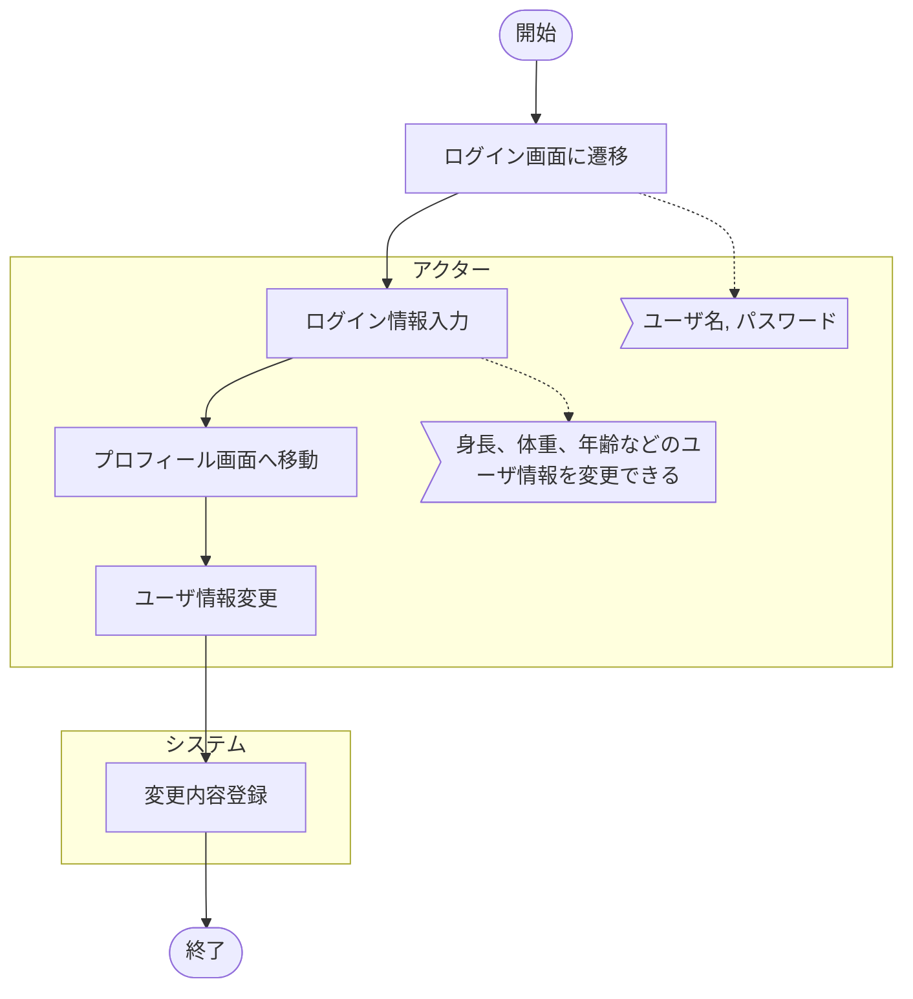

# UC006_ユーザー情報の変更
 
## 目的（ゴール）
 
ユーザー情報の変更をシステムに反映する
 
## アクター
 
サービス利用者
 
## 事前条件
 
- なし
 
## 事後条件
 
- 入力されたユーザー情報をシステムに反映する
 
## イベントフロー
 
### メインフロー
 

 
## 備考
 
ログイン画面(http://localhost:3000/login)からユーザー情報を登録する

- 以下のURLにユーザーが入力したデータを送る 
- バックエンドからは、新規登録画面で登録したデータを受け取る（暫定なので変更する可能性大）

| 項目        | 値                                |
| ---------- | --------------------------------  |
| **URL**    | `http://127.0.0.1:8000/user/login`|
| **Method** | `POST`                            |
| **Body**   | ユーザー登録情報（以下に詳細）         |

- bodyの情報はユーザー情報のデータクラスからなる

| フィールド名        | 説明    | 値の例（仮）         |  型 　  |
| ------------- | ----------- | ----------------- |------   |
| `mailAddress` | メールアドレス | `"taro@example.com"`|string |
| `password`    | パスワード     | `"password123"`    | string|

- バックエンドから受け取るデータクラス

| フィールド名        | 説明    | 値の例（仮）         |  型 　  |
| ------------- | ----------- | ----------------- |------   |
| `firstName`   | 名           | `"太郎"`          | string  |
| `lastName`    | 姓             | `"山田"`         | string |
| `gender`      | 性別           | `"男性"`          | string |
| `age`         | 年齢           | `25`             | number |
| `birthday`    | 生年月日（文字列） | `"1998-01-01"` | string |
| `mailAddress` | メールアドレス | `"taro@example.com"`|string |
| `password`    | パスワード     | `"password123"`    | string|