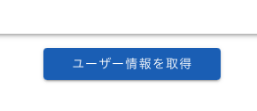
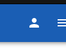
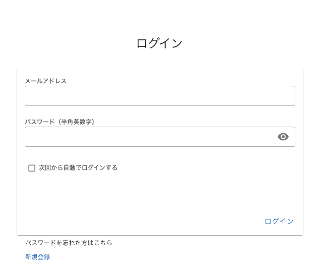

# Nuxt Minimal Starter

Look at the [Nuxt documentation](https://nuxt.com/docs/getting-started/introduction) to learn more.

## node_moduleのインストール

1. diet-support-app ディレクトリに移動  
2. 以下のコマンドを実行

```bash
npm install
```

## debugの実行

Start the development server on `http://localhost:3000`:

1. 「Nuxt dev + Chrome」または「スクリプトの実行：dev」を選択し実行
2. または以下のコマンドを実行

```bash
npm run dev
```


#  仮実装

## データ取得



- 押下すると以下のURLにアクセスする  

```url
http://127.0.0.1:8000/users/
```

- バックエンドには以下のデータを転送する

```Body
  email   : "test@example.com"
  password: "test"
```

## ログイン



- ヘッダー部にあるアイコンを押下すると以下ログイン画面に遷移する



- ログインには以下を入力する

```ログイン入力情報
  メールアドレス：test
  パスワード　　：test
```